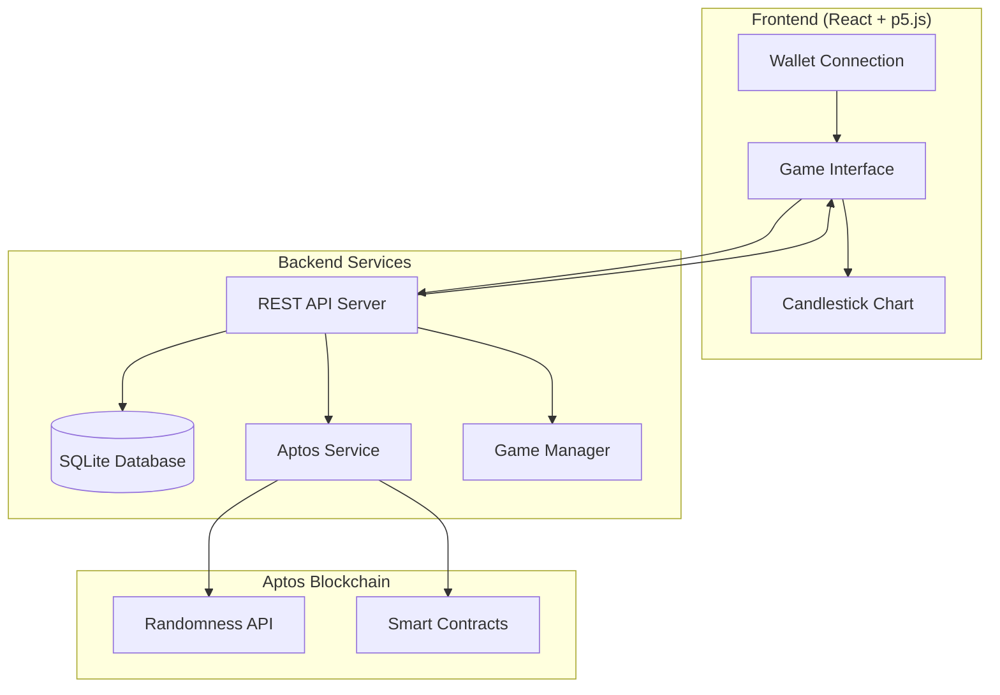

# Cash Markets Technical Implementation Document
## High-Frequency Trading Game on Aptos Blockchain

---

## UPDATED: Current State Analysis & Implementation Path

### **PR Assessment: Sam's Implementation (feature/game_manager)**

After analyzing Sam's PR, we have a **solid foundation** that aligns with our simplified architecture goals. The PR should be **ACCEPTED** with specific enhancements for production use.

#### **What Sam Built (✅ Ready to Use):**
- **SQLite Database**: Users, Rounds, Trades tables with proper relationships
- **Deterministic Candle Generation**: Seed-based chart generation using SHA256
- **REST API Architecture**: Much simpler than WebSocket complexity
- **GameManager System**: Complete game lifecycle management
- **Replay System**: URL-based replay for debugging (`?replay=roundId`)
- **Mock Aptos Service**: Ready to be replaced with real integration

#### **Required Enhancements (⚠️ Need Implementation):**
- Replace mock Aptos service with real wallet integration
- Add authentication middleware and session management
- Integrate GameManager with main app (currently only test interface)
- Add financial transaction endpoints for deposits/withdrawals
- Enhance database schema for production use

---

## 1. System Overview and Core Architecture

### 1.1 What We're Building (Updated)

Cash Markets is a **deterministic trading game** where each player gets their own verifiable round using Aptos blockchain seeds. We've simplified from the original synchronized multiplayer approach to focus on **individual verifiable games** that can later be enhanced with multiplayer features.

**Key Architecture Decisions:**
- **Individual Rounds**: Each player gets their own game instance with unique Aptos seed
- **Deterministic Generation**: Same seed always produces identical candles
- **REST API**: Simple HTTP endpoints instead of complex WebSocket infrastructure  
- **SQLite Foundation**: Fast development with easy PostgreSQL migration path
- **Wallet-First Authentication**: Aptos address becomes user identity

### 1.2 Updated Data Flow Architecture



**Simplified Flow:**
1. **User connects Aptos wallet** → Frontend gets address + public key
2. **Authentication** → Backend verifies wallet signature, creates session
3. **Start Round** → Backend calls Aptos randomness API for seed
4. **Generate Candles** → Deterministic generation from seed on frontend
5. **Trade Execution** → Backend validates trades against regenerated candles
6. **Settlement** → Backend updates balances, optionally settles on-chain

---

## 2. Database Architecture (Enhanced from Sam's PR)

### 2.1 Core Schema (Based on Sam's Foundation)

```sql
-- Enhanced Users Table (building on Sam's schema)
CREATE TABLE users (
    id TEXT PRIMARY KEY DEFAULT (hex(randomblob(16))),
    aptos_address TEXT UNIQUE NOT NULL,
    public_key TEXT NOT NULL,
    username TEXT GENERATED ALWAYS AS (
        'Player_' || substr(aptos_address, 3, 6)
    ) STORED,
    display_name TEXT,
    
    -- Balances (enhanced from Sam's version)
    game_balance REAL DEFAULT 0.0,
    locked_balance REAL DEFAULT 0.0,
    lifetime_deposited REAL DEFAULT 0.0,
    lifetime_withdrawn REAL DEFAULT 0.0,
    lifetime_pnl REAL DEFAULT 0.0,
    
    -- Authentication (new fields)
    last_challenge TEXT,
    challenge_expires_at DATETIME,
    session_token TEXT,
    session_expires_at DATETIME,
    
    -- Metadata
    created_at DATETIME DEFAULT CURRENT_TIMESTAMP,
    last_login DATETIME,
    total_rounds_played INTEGER DEFAULT 0,
    total_trades INTEGER DEFAULT 0
);

-- Enhanced Rounds Table (building on Sam's schema)
CREATE TABLE rounds (
    id TEXT PRIMARY KEY DEFAULT (hex(randomblob(16))),
    user_id TEXT NOT NULL, -- Individual rounds per user
    
    -- Aptos Integration (enhanced)
    aptos_seed TEXT NOT NULL,
    aptos_block_height INTEGER,
    aptos_transaction_hash TEXT,
    seed_verification_hash TEXT,
    
    -- Round Configuration
    duration_ms INTEGER DEFAULT 30000,
    candle_interval_ms INTEGER DEFAULT 65,
    total_candles INTEGER DEFAULT 460,
    initial_price REAL DEFAULT 100.0,
    
    -- Round State
    status TEXT DEFAULT 'ACTIVE' CHECK (status IN ('ACTIVE', 'COMPLETED', 'DISPUTED')),
    started_at DATETIME DEFAULT CURRENT_TIMESTAMP,
    ended_at DATETIME,
    final_price REAL,
    
    -- Game Configuration (JSON)
    config TEXT,
    
    FOREIGN KEY (user_id) REFERENCES users (id),
    UNIQUE(user_id, aptos_seed) -- Prevent seed reuse per user
);

-- Enhanced Trades Table (building on Sam's schema)
CREATE TABLE trades (
    id TEXT PRIMARY KEY DEFAULT (hex(randomblob(16))),
    round_id TEXT NOT NULL,
    user_id TEXT NOT NULL,
    
    -- Trade Details
    direction TEXT NOT NULL CHECK (direction IN ('LONG', 'SHORT')),
    size REAL NOT NULL,
    entry_price REAL NOT NULL,
    exit_price REAL,
    
    -- Timing & Verification
    entry_candle_index INTEGER NOT NULL,
    exit_candle_index INTEGER,
    opened_at DATETIME DEFAULT CURRENT_TIMESTAMP,
    closed_at DATETIME,
    
    -- Results
    gross_pnl REAL DEFAULT 0.0,
    fees REAL DEFAULT 0.0,
    net_pnl REAL DEFAULT 0.0,
    status TEXT DEFAULT 'OPEN' CHECK (status IN ('OPEN', 'CLOSED')),
    
    -- Server-side verification
    entry_price_verified BOOLEAN DEFAULT FALSE,
    exit_price_verified BOOLEAN DEFAULT FALSE,
    
    FOREIGN KEY (round_id) REFERENCES rounds (id),
    FOREIGN KEY (user_id) REFERENCES users (id)
);

-- New: Financial Transactions Table
CREATE TABLE financial_transactions (
    id TEXT PRIMARY KEY DEFAULT (hex(randomblob(16))),
    user_id TEXT NOT NULL,
    
    type TEXT NOT NULL CHECK (type IN ('DEPOSIT', 'WITHDRAWAL')),
    amount REAL NOT NULL,
    
    -- Aptos Integration
    aptos_transaction_hash TEXT,
    aptos_block_height INTEGER,
    
    -- Status Tracking
    status TEXT DEFAULT 'PENDING' CHECK (status IN ('PENDING', 'COMPLETED', 'FAILED')),
    requested_at DATETIME DEFAULT CURRENT_TIMESTAMP,
    processed_at DATETIME,
    
    FOREIGN KEY (user_id) REFERENCES users (id)
);
```

---

## 3. Authentication & User Management

### 3.1 Wallet-First Authentication Flow

```typescript
// Authentication Flow Implementation
interface AuthFlow {
  // Step 1: Connect Wallet
  connectWallet(): Promise<{address: string, publicKey: string}>
  
  // Step 2: Generate Challenge
  generateChallenge(address: string): Promise<{challenge: string, expires: Date}>
  
  // Step 3: Sign Challenge  
  signChallenge(challenge: string): Promise<{signature: string}>
  
  // Step 4: Verify & Create Session
  verifyAndCreateSession(address: string, signature: string): Promise<{
    userId: string,
    sessionToken: string,
    expiresAt: Date
  }>
}
```

### 3.2 Frontend Wallet Integration

```typescript
// Enhanced Wallet Service (replacing Sam's mock)
class AptosWalletService {
  private wallet: any = null;
  
  async connectWallet(): Promise<{address: string, publicKey: string}> {
    if (!window.aptos) {
      throw new Error('Please install Petra Wallet or another Aptos wallet');
    }
    
    const response = await window.aptos.connect();
    this.wallet = response;
    
    return {
      address: response.address,
      publicKey: response.publicKey
    };
  }
  
  async signMessage(message: string): Promise<string> {
    if (!this.wallet) throw new Error('Wallet not connected');
    
    const result = await window.aptos.signMessage({
      message,
      nonce: Date.now().toString()
    });
    
    return result.signature;
  }
  
  async authenticateUser(): Promise<{token: string, userId: string}> {
    const challenge = await this.generateChallenge();
    const signature = await this.signMessage(challenge.message);
    
    const response = await fetch('/api/auth/verify', {
      method: 'POST',
      headers: {'Content-Type': 'application/json'},
      body: JSON.stringify({
        address: this.wallet.address,
        signature,
        challenge: challenge.challenge
      })
    });
    
    return response.json();
  }
}
```

---

## 4. Game Engine Architecture (Based on Sam's GameManager)

### 4.1 Enhanced GameManager Integration

```typescript
// Integration with main app (not just test interface)
class ProductionGameManager extends GameManager {
  private authService: AptosWalletService;
  private apiService: ApiService;
  
  constructor() {
    super();
    this.authService = new AptosWalletService();
    this.apiService = new ApiService();
  }
  
  async startAuthenticatedRound(): Promise<void> {
    // Ensure user is authenticated
    if (!this.authService.isConnected()) {
      await this.authService.connectWallet();
      await this.authService.authenticateUser();
    }
    
    // Start round with real Aptos seed
    const response = await this.apiService.post('/api/game/start');
    
    this.roundId = response.data.roundId;
    this.seed = response.data.seed; // Real Aptos seed
    this.config = response.data.config;
    
    // Initialize deterministic generator (Sam's implementation)
    this.candleGenerator = new CandleGenerator(this.seed, this.config);
    
    // Start game loop
    this.startCandleGeneration();
  }
  
  async openVerifiedPosition(direction: 'LONG' | 'SHORT', size: number): Promise<void> {
    // Client-side position opening
    await this.openPosition(direction, size);
    
    // Server-side verification
    const currentCandle = this.getCurrentCandle();
    await this.apiService.post('/api/trade/open', {
      roundId: this.roundId,
      direction,
      size,
      candleIndex: currentCandle.index,
      claimedPrice: currentCandle.close
    });
  }
}
```

### 4.2 Server-Side Trade Verification

```typescript
// Enhanced trade verification (building on Sam's API)
export const verifyTrade = async (req: AuthRequest, res: Response) => {
  const { roundId, direction, size, candleIndex, claimedPrice } = req.body;
  const { userId } = req.user;
  
  // Get round and verify ownership
  const round = await db.getRoundById(roundId);
  if (!round || round.user_id !== userId) {
    return res.status(400).json({ error: 'Invalid round' });
  }
  
  // Regenerate candle to verify price
  const generator = new CandleGenerator(round.aptos_seed, JSON.parse(round.config));
  const expectedCandle = generator.generateCandle(candleIndex);
  
  // Verify price within tolerance
  if (Math.abs(expectedCandle.close - claimedPrice) > 0.001) {
    return res.status(400).json({ error: 'Price verification failed' });
  }
  
  // Check user balance
  const user = await db.getUserById(userId);
  const requiredMargin = size * 0.1; // 10% margin
  
  if (user.game_balance - user.locked_balance < requiredMargin) {
    return res.status(400).json({ error: 'Insufficient balance' });
  }
  
  // Create verified trade
  const trade = await db.createTrade({
    roundId,
    userId,
    direction,
    size,
    entryPrice: expectedCandle.close, // Use server-verified price
    entryCandleIndex: candleIndex,
    entryPriceVerified: true
  });
  
  // Lock funds
  await db.updateUserLockedBalance(userId, user.locked_balance + requiredMargin);
  
  res.json({ trade });
};
```

---

## 5. Real Aptos Integration (Replacing Sam's Mock)

### 5.1 Production Aptos Service

```typescript
// Replace server/services/AptosService.ts mock with real implementation
export class ProductionAptosService {
  private client: AptosClient;
  private gameAccount: AptosAccount;
  
  constructor() {
    this.client = new AptosClient(process.env.APTOS_NODE_URL!);
    
    // Load game account from environment
    const privateKey = process.env.APTOS_GAME_PRIVATE_KEY!;
    this.gameAccount = new AptosAccount(HexString.ensure(privateKey).toUint8Array());
  }
  
  async generateRandomSeed(): Promise<SeedData> {
    try {
      // Call real Aptos randomness API
      const payload = {
        function: "0x1::randomness::u256_integer",
        type_arguments: [],
        arguments: []
      };
      
      const txn = await this.client.generateTransaction(
        this.gameAccount.address(),
        payload,
        { gas_unit_price: "100", max_gas_amount: "2000" }
      );
      
      const signedTxn = await this.client.signTransaction(this.gameAccount, txn);
      const result = await this.client.submitTransaction(signedTxn);
      
      // Wait for confirmation
      await this.client.waitForTransaction(result.hash);
      
      // Get transaction details
      const txDetails = await this.client.getTransactionByHash(result.hash);
      
      // Extract seed from transaction events or return value
      const seed = this.extractSeedFromTransaction(txDetails);
      
      return {
        seed: seed.startsWith('0x') ? seed : `0x${seed}`,
        blockHeight: parseInt(txDetails.version),
        transactionHash: result.hash,
        timestamp: Date.now()
      };
      
    } catch (error) {
      console.error('Aptos seed generation failed:', error);
      throw new Error('Failed to generate random seed from Aptos');
    }
  }
  
  private extractSeedFromTransaction(txDetails: any): string {
    // Extract seed from transaction events or return value
    // Implementation depends on Aptos randomness API response format
    if (txDetails.events && txDetails.events.length > 0) {
      const randomEvent = txDetails.events.find(e => 
        e.type.includes('randomness') || e.type.includes('Random')
      );
      
      if (randomEvent && randomEvent.data.value) {
        return randomEvent.data.value;
      }
    }
    
    // Fallback: use transaction hash as seed source
    return txDetails.hash;
  }
}
```

---

## 6. Implementation Timeline & Next Steps

### Phase 1: PR Integration (Week 1)
1. **Accept Sam's PR** - Merge feature/game_manager branch
2. **Test Integration** - Verify Sam's test interface works
3. **Replace Mock Services** - Implement real Aptos integration
4. **Add Authentication** - Wallet connection + session management

### Phase 2: Production Features (Week 2)
1. **Frontend Integration** - Connect GameManager to main app
2. **Financial Endpoints** - Deposit/withdrawal API
3. **Trade Verification** - Server-side price validation
4. **Balance Management** - Real money tracking

### Phase 3: Enhancement (Week 3-4)
1. **Smart Contracts** - Deploy Move contracts for settlements
2. **House Edge** - Implement mathematical advantage
3. **Error Handling** - Comprehensive error recovery
4. **Security Audit** - Review before mainnet

---

## 7. Migration from Current System

### 7.1 Gradual Migration Strategy

```typescript
// Support both systems during transition
function App() {
  const [useNewSystem, setUseNewSystem] = useState(false);
  
  useEffect(() => {
    const urlParams = new URLSearchParams(window.location.search);
    const forceNew = urlParams.get('gamemanager') === 'true';
    const showTest = urlParams.get('test') === 'true';
    
    if (showTest) {
      return <GameManagerTest />; // Sam's test interface
    }
    
    if (forceNew) {
      setUseNewSystem(true);
    }
  }, []);
  
  if (useNewSystem) {
    return <ProductionGameApp />; // New system with real Aptos
  }
  
  return <CandlestickChart />; // Original system for comparison
}
```

### 7.2 Feature Parity Checklist

| Feature | Original System | Sam's System | Status |
|---------|----------------|--------------|--------|
| Chart Rendering | ✅ p5.js | ✅ p5.js | Compatible |
| Position Management | ✅ Local state | ✅ GameManager | Enhanced |
| Balance Tracking | ✅ Local state | ✅ Database | Enhanced |
| Seed Generation | ❌ Static data | ✅ Aptos seeds | New feature |
| Trade Verification | ❌ None | ✅ Server-side | New feature |
| Replay System | ❌ None | ✅ URL-based | New feature |
| User Authentication | ❌ None | ⚠️ Mock | Needs real implementation |

---

## Conclusion

Sam's PR provides an excellent foundation that aligns perfectly with our simplified architecture goals. The deterministic candle generation, SQLite database, and REST API approach is much more practical than the complex WebSocket architecture originally planned.

**Recommendation: ACCEPT the PR and implement the enhancements outlined above.**

The key insight is that Sam has solved the core technical challenges (deterministic generation, database design, API structure) while leaving room for us to add the production features (real Aptos integration, authentication, financial operations) in a structured way.

This approach allows us to:
1. **Ship quickly** with a working foundation
2. **Iterate safely** with both systems running in parallel
3. **Scale gradually** from individual games to multiplayer features
4. **Maintain quality** with proper verification and replay systems

*Document Version: 4.0 | Last Updated: Current Date*
*Major Update: Integration plan for Sam's feature/game_manager PR*
