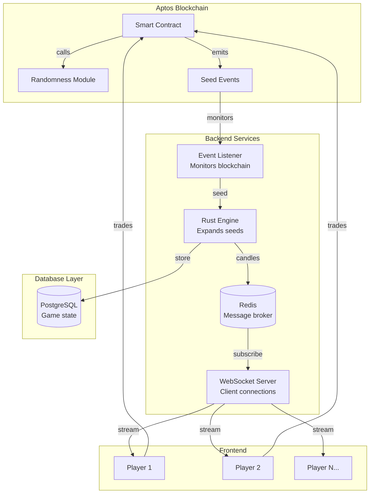

# Cash Markets Technical Implementation Document
## High-Frequency Trading Game on Aptos Blockchain

---

## 1. System Overview and Core Architecture

### 1.1 What We're Building

Cash Markets is a shared-experience trading game where all players watch the same candlestick chart update every 65 milliseconds. The technical challenge we're solving is creating a provably fair, high-frequency game that feels responsive like a centralized application while maintaining blockchain-based trust guarantees. Every player sees the exact same price movements at the exact same time, creating a synchronized trading environment where quick decisions determine success.

The architecture combines on-chain randomness generation with off-chain computational expansion. We generate unpredictable seeds on Aptos blockchain every 650 milliseconds, expand them into candlestick data using a deterministic Rust service, and stream the results to all connected clients via WebSocket. This hybrid approach lets us achieve sub-100ms visual updates while maintaining cryptographic proof that the game is fair.

### 1.2 Core Components and Data Flow



The data flow begins when our smart contract calls Aptos's randomness API to generate a 256-bit seed. This happens every 650 milliseconds, which gives us enough time for blockchain finality (about 600ms) plus a small buffer. The contract emits an event containing this seed, which our backend event listener is constantly monitoring for.

When the listener detects a new seed event, it immediately passes the seed to our Rust expansion engine. This engine runs a deterministic algorithm that transforms the 256-bit seed into exactly 10 candlesticks, each with open, high, low, and close prices. The determinism is crucial - anyone can take the same seed and generate the exact same candles, allowing independent verification of fairness.

The generated candles are published to Redis, which acts as our message broker between services. The WebSocket server subscribes to Redis channels and immediately broadcasts new candle data to all connected clients. This pub-sub pattern ensures that every player receives the same data at the same time, maintaining the synchronized experience that makes the game exciting.

## 2. Smart Contract Architecture

### 2.1 Contract Design Philosophy

Our Move contracts on Aptos are deliberately minimal, handling only what absolutely must be on-chain for trust and security. The contracts have three primary responsibilities: generating unpredictable random seeds that no one can manipulate, managing player deposits and withdrawals to ensure fund safety, and recording round results for transparent settlement.

```rust
module cash_markets::game {
    use std::vector;
    use aptos_framework::randomness;
    use aptos_framework::timestamp;
    use aptos_framework::event;
    
    /// Round represents one 30-second game session
    struct Round has key {
        round_id: u64,
        status: u8,  // 0: pending, 1: active, 2: complete
        start_time: u64,
        batch_count: u8,
        seeds: vector<vector<u8>>,  // Store all 46 seeds
        total_volume: u64,
        player_count: u64,
    }
    
    /// Player balance tracking
    struct PlayerAccount has key {
        address: address,
        balance: u64,
        locked_balance: u64,  // Funds in active trades
        total_deposited: u64,
        total_withdrawn: u64,
        lifetime_pnl: i64,
    }
    
    /// Event emitted when new seed is generated
    struct SeedGenerated has drop, store {
        round_id: u64,
        batch_index: u8,
        seed: vector<u8>,
        timestamp: u64,
    }
}
```

### 2.2 Randomness Generation Implementation

The heart of our system is the seed generation function that produces unpredictable values for candlestick creation. We use Aptos's native randomness module, which aggregates entropy from multiple validators to ensure no single party can predict or manipulate the output.

```rust
/// Called every 650ms during active rounds
#[randomness]
public entry fun generate_batch_seed(account: &signer) acquires Round {
    let round = borrow_global_mut<Round>(@cash_markets);
    assert!(round.status == 1, ERROR_ROUND_NOT_ACTIVE);
    assert!(round.batch_count < 46, ERROR_ROUND_COMPLETE);
    
    // Generate 256-bit random seed
    let seed = randomness::u256_integer();
    let seed_bytes = bcs::to_bytes(&seed);
    
    // Store seed for verification
    vector::push_back(&mut round.seeds, seed_bytes);
    round.batch_count = round.batch_count + 1;
    
    // Emit event for off-chain processing
    event::emit(SeedGenerated {
        round_id: round.round_id,
        batch_index: round.batch_count,
        seed: seed_bytes,
        timestamp: timestamp::now_microseconds(),
    });
    
    // Check if round is complete
    if (round.batch_count == 46) {
        round.status = 2;  // Mark as complete
        settle_round_internal(round);
    }
}
```

Each call to the randomness API costs approximately 2,000 gas units. With 46 batches per 30-second round and 2,880 rounds per day, we spend about 92,000 gas units per round or roughly 0.001 APT. This is a manageable cost that's easily covered by our house edge.

### 2.3 Financial Operations

All money flows through our smart contracts to ensure transparency and security. Players deposit APT into the contract to receive an in-game balance they can use for trading. When they want to cash out, they request a withdrawal which is processed after a short delay for security.

```rust
public entry fun deposit(player: &signer, amount: u64) acquires PlayerAccount {
    let player_addr = signer::address_of(player);
    
    // Transfer APT from player to contract
    let coins = coin::withdraw<AptosCoin>(player, amount);
    coin::deposit(@cash_markets, coins);
    
    // Update player balance
    if (!exists<PlayerAccount>(player_addr)) {
        move_to(player, PlayerAccount {
            address: player_addr,
            balance: 0,
            locked_balance: 0,
            total_deposited: 0,
            total_withdrawn: 0,
            lifetime_pnl: 0,
        });
    }
    
    let account = borrow_global_mut<PlayerAccount>(player_addr);
    account.balance = account.balance + amount;
    account.total_deposited = account.total_deposited + amount;
    
    event::emit(DepositEvent {
        player: player_addr,
        amount,
        new_balance: account.balance,
        timestamp: timestamp::now_microseconds(),
    });
}
```

The settlement system processes all trades at the end of each round. We calculate profit and loss for each player based on their entry and exit prices, then update balances atomically. This happens in a single transaction to ensure consistency - either all settlements succeed or none do.

## 3. Backend Services Architecture

### 3.1 Event Listener Service

The event listener maintains a persistent WebSocket connection to an Aptos full node, monitoring for events from our smart contract. This service is critical because it bridges the blockchain and our off-chain processing. When it detects a new seed event, it must immediately trigger the expansion process to maintain our 65ms update rate.

```typescript
class AptosEventListener {
    private client: AptosClient;
    private lastProcessedVersion: bigint = 0n;
    
    async start() {
        // Connect to Aptos node
        this.client = new AptosClient(process.env.APTOS_NODE_URL);
        
        // Subscribe to events from our contract
        const eventHandle = `${CONTRACT_ADDRESS}::game::SeedGenerated`;
        
        while (true) {
            try {
                const events = await this.client.getEventsByEventHandle(
                    eventHandle,
                    this.lastProcessedVersion,
                    100  // Batch size
                );
                
                for (const event of events) {
                    await this.processSeedEvent(event);
                    this.lastProcessedVersion = event.version;
                }
                
                // Poll every 100ms for new events
                await sleep(100);
            } catch (error) {
                console.error('Event listener error:', error);
                await sleep(1000);  // Back off on error
            }
        }
    }
    
    private async processSeedEvent(event: Event) {
        const { round_id, batch_index, seed } = event.data;
        
        // Send to Rust engine via gRPC
        await engineClient.expandSeed({
            roundId: round_id,
            batchIndex: batch_index,
            seed: Buffer.from(seed, 'hex'),
        });
        
        // Log for monitoring
        console.log(`Processed seed for round ${round_id}, batch ${batch_index}`);
    }
}
```

### 3.2 Rust Expansion Engine

The expansion engine is where the magic happens - transforming random seeds into realistic candlestick patterns. We use Rust for this component because we need absolute determinism. JavaScript's floating-point operations can vary slightly across different engines or platforms, but Rust gives us bit-perfect reproducibility.

```rust
use rand_chacha::ChaCha20Rng;
use rand::{Rng, SeedableRng};

pub struct CandleGenerator {
    rng: ChaCha20Rng,
    previous_close: f64,
    candle_count: u32,
    momentum: f64,
}

impl CandleGenerator {
    pub fn expand_seed(seed: [u8; 32], batch_index: u8) -> Vec<Candle> {
        let mut generator = Self {
            rng: ChaCha20Rng::from_seed(seed),
            previous_close: 100.0,  // Starting price
            candle_count: batch_index as u32 * 10,
            momentum: 0.0,
        };
        
        let mut candles = Vec::with_capacity(10);
        for i in 0..10 {
            candles.push(generator.generate_candle());
        }
        
        candles
    }
    
    fn generate_candle(&mut self) -> Candle {
        // Base drift creates house edge
        let drift = -0.0001;  // -0.01% per candle
        
        // Volatility creates excitement
        let volatility = 0.02;  // 2% standard deviation
        let random_walk = self.rng.gen_range(-1.0..1.0);
        
        // Calculate price movement
        let return_pct = drift + volatility * random_walk;
        
        // Add momentum for trending behavior
        self.momentum = self.momentum * 0.95 + return_pct * 0.05;
        let total_return = return_pct + self.momentum * 0.1;
        
        // Check for special events
        if self.should_trigger_pump() {
            return self.create_pump_candle();
        }
        
        if self.should_trigger_dump() {
            return self.create_dump_candle();
        }
        
        // Normal candle generation
        let open = self.previous_close;
        let close = open * (1.0 + total_return);
        
        // Add wicks for realism
        let high = close.max(open) * (1.0 + self.rng.gen_range(0.0..0.005));
        let low = close.min(open) * (1.0 - self.rng.gen_range(0.0..0.005));
        
        self.previous_close = close;
        self.candle_count += 1;
        
        Candle {
            timestamp: self.candle_count * 65,
            open,
            high,
            low,
            close,
            volume: self.generate_volume(),
        }
    }
}
```

### 3.3 House Edge Mathematics

The house edge is built into the candlestick generation algorithm through three mechanisms. First, there's a slight negative drift of -0.01% per candle, which compounds to about -4.6% over a full round. Second, we introduce asymmetric jump events where negative jumps are larger than positive ones. Third, and most importantly, we have liquidation events that can wipe out positions entirely.

| Mechanism | Probability | Impact | Expected Value |
|-----------|------------|--------|----------------|
| Base Drift | 100% | -0.01% per candle | -4.6% per round |
| Pump Events | 0.5% | +8% instant gain | +0.04% per candle |
| Dump Events | 0.3% | -15% instant loss | -0.045% per candle |
| Liquidations | 0.15% after candle 80 | -95% of position | -0.14% per candle |

The liquidation mechanism deserves special attention. After the round is one-third complete (candle 80), there's a small but increasing chance of a catastrophic price collapse. The probability starts at 0.15% per candle and increases by 0.01% for each subsequent candle. This creates psychological tension - the longer players hold, the more they might profit, but also the higher the risk of total loss.

```rust
fn should_trigger_liquidation(&mut self) -> bool {
    if self.candle_count < 80 {
        return false;  // No liquidations in first third
    }
    
    let candles_since_80 = self.candle_count - 80;
    let probability = 0.0015 + 0.0001 * candles_since_80 as f64;
    
    self.rng.gen_bool(probability)
}

fn create_liquidation_candle(&mut self) -> Candle {
    let open = self.previous_close;
    let close = open * 0.05;  // 95% drop
    
    // Make it look dramatic
    let high = open * 0.98;  // Brief hope
    let low = close * 0.95;  // Oversold bounce
    
    self.previous_close = close;
    self.candle_count += 1;
    
    Candle {
        timestamp: self.candle_count * 65,
        open,
        high,
        low,
        close,
        volume: self.generate_volume() * 10.0,  // High volume on liquidation
    }
}
```

## 4. WebSocket and Real-Time Distribution

### 4.1 WebSocket Server Architecture

The WebSocket server manages thousands of concurrent connections and ensures all players receive synchronized data. Each client connection is stateful, tracking what data streams they're subscribed to and their current sync status. The server uses Redis pub-sub to receive candle data from the expansion engine and immediately broadcasts to all subscribed clients.

```typescript
class GameWebSocketServer {
    private wss: WebSocketServer;
    private redis: RedisClient;
    private connections: Map<string, ClientConnection> = new Map();
    
    async initialize() {
        this.wss = new WebSocketServer({ port: 3001 });
        this.redis = new RedisClient();
        
        // Subscribe to candle updates from engine
        await this.redis.subscribe('candles:*');
        
        this.redis.on('message', (channel, message) => {
            this.handleCandleUpdate(channel, JSON.parse(message));
        });
        
        this.wss.on('connection', (ws) => {
            this.handleNewConnection(ws);
        });
    }
    
    private handleNewConnection(ws: WebSocket) {
        const connectionId = generateId();
        const client = new ClientConnection(connectionId, ws);
        
        this.connections.set(connectionId, client);
        
        ws.on('message', (data) => {
            const message = JSON.parse(data.toString());
            this.handleClientMessage(client, message);
        });
        
        ws.on('close', () => {
            this.connections.delete(connectionId);
        });
        
        // Send initial connection acknowledgment
        ws.send(JSON.stringify({
            type: 'CONNECTION_ACK',
            connectionId,
            serverTime: Date.now(),
        }));
    }
    
    private handleCandleUpdate(channel: string, candle: Candle) {
        const roundId = channel.split(':')[1];
        
        // Broadcast to all clients subscribed to this round
        for (const client of this.connections.values()) {
            if (client.isSubscribedTo(`round:${roundId}`)) {
                client.send({
                    type: 'CANDLE',
                    roundId,
                    candle,
                });
            }
        }
    }
}
```

### 4.2 Subscription Management

Subscription management determines which clients receive which data. When a client connects, they start with no subscriptions and must explicitly request the data streams they want. This allows us to optimize bandwidth - we don't send historical round data to players who just want to watch the current round.

```typescript
class ClientConnection {
    private subscriptions: Set<string> = new Set();
    private lastHeartbeat: number = Date.now();
    
    subscribe(topic: string) {
        // Validate topic format
        if (!this.isValidTopic(topic)) {
            throw new Error(`Invalid topic: ${topic}`);
        }
        
        // Check subscription limits
        if (this.subscriptions.size >= 10) {
            throw new Error('Maximum subscriptions reached');
        }
        
        this.subscriptions.add(topic);
        
        // Send confirmation
        this.send({
            type: 'SUBSCRIBED',
            topic,
        });
    }
    
    unsubscribe(topic: string) {
        this.subscriptions.delete(topic);
        
        this.send({
            type: 'UNSUBSCRIBED',
            topic,
        });
    }
    
    isSubscribedTo(topic: string): boolean {
        // Check exact match
        if (this.subscriptions.has(topic)) {
            return true;
        }
        
        // Check wildcard subscriptions
        for (const sub of this.subscriptions) {
            if (sub.includes('*')) {
                const pattern = sub.replace('*', '.*');
                if (new RegExp(pattern).test(topic)) {
                    return true;
                }
            }
        }
        
        return false;
    }
}
```

### 4.3 Synchronized Playback

The core challenge is ensuring all players see the same candle at the same time despite different network latencies. We solve this through timestamp-based scheduling. Each candle includes a precise timestamp indicating when it should be displayed, calculated from the round start time.

```typescript
// Client-side synchronization
class ChartSynchronizer {
    private roundStartTime: number;
    private candleBuffer: Candle[] = [];
    private currentIndex: number = 0;
    private renderTimer: NodeJS.Timer;
    
    startRound(startTime: number) {
        this.roundStartTime = startTime;
        this.currentIndex = 0;
        this.candleBuffer = [];
        
        // Start render loop at exactly 65ms intervals
        this.renderTimer = setInterval(() => {
            this.renderNextCandle();
        }, 65);
    }
    
    addCandles(candles: Candle[]) {
        // Add to buffer for future rendering
        this.candleBuffer.push(...candles);
        
        // Sort by timestamp to handle out-of-order delivery
        this.candleBuffer.sort((a, b) => a.timestamp - b.timestamp);
    }
    
    private renderNextCandle() {
        const now = Date.now();
        const elapsed = now - this.roundStartTime;
        const expectedIndex = Math.floor(elapsed / 65);
        
        // Check if we have the candle we need
        if (this.candleBuffer[expectedIndex]) {
            this.chart.addCandle(this.candleBuffer[expectedIndex]);
            this.currentIndex = expectedIndex + 1;
        } else {
            // Missing candle - show loading state
            console.warn(`Missing candle ${expectedIndex}`);
        }
    }
}
```

## 5. Database Design

### 5.1 Core Data Model

Our PostgreSQL database stores game state, user information, and historical data. The schema is optimized for write performance during gameplay with minimal indexes. We rebuild analytical indexes during quiet periods for reporting.

```sql
-- Essential tables only
CREATE TABLE users (
    id SERIAL PRIMARY KEY,
    aptos_address VARCHAR(66) UNIQUE NOT NULL,
    balance DECIMAL(20, 8) DEFAULT 0,
    created_at TIMESTAMP DEFAULT NOW()
);

CREATE TABLE rounds (
    id SERIAL PRIMARY KEY,
    round_number BIGINT UNIQUE NOT NULL,
    status VARCHAR(20) NOT NULL,
    start_time TIMESTAMP NOT NULL,
    end_time TIMESTAMP,
    seeds JSONB,  -- Array of hex seeds
    created_at TIMESTAMP DEFAULT NOW()
);

CREATE TABLE trades (
    id SERIAL PRIMARY KEY,
    user_id INTEGER REFERENCES users(id),
    round_id INTEGER REFERENCES rounds(id),
    side VARCHAR(10) NOT NULL,  -- LONG or SHORT
    entry_price DECIMAL(20, 8) NOT NULL,
    exit_price DECIMAL(20, 8),
    size DECIMAL(20, 8) NOT NULL,
    pnl DECIMAL(20, 8),
    status VARCHAR(20) DEFAULT 'OPEN',
    opened_at TIMESTAMP DEFAULT NOW(),
    closed_at TIMESTAMP
);

CREATE TABLE candles (
    round_id INTEGER REFERENCES rounds(id),
    batch_index INTEGER NOT NULL,
    candle_index INTEGER NOT NULL,
    timestamp BIGINT NOT NULL,
    open DECIMAL(20, 8) NOT NULL,
    high DECIMAL(20, 8) NOT NULL,
    low DECIMAL(20, 8) NOT NULL,
    close DECIMAL(20, 8) NOT NULL,
    PRIMARY KEY (round_id, batch_index, candle_index)
);

-- Minimal indexes for performance
CREATE INDEX idx_trades_user_open ON trades(user_id) WHERE status = 'OPEN';
CREATE INDEX idx_rounds_active ON rounds(status) WHERE status = 'ACTIVE';
```

### 5.2 Redis Cache Layer

Redis serves as our high-performance cache and message broker. It stores active game state that needs microsecond access times and handles pub-sub for real-time data distribution.

```typescript
// Redis key patterns and their purposes
const REDIS_KEYS = {
    // Current round information
    ACTIVE_ROUND: 'game:round:active',  // Current round ID
    
    // Candle data for streaming
    ROUND_CANDLES: (roundId: string) => `round:${roundId}:candles`,
    
    // User session data
    USER_SESSION: (userId: string) => `user:${userId}:session`,
    
    // Active trades for quick lookup
    USER_TRADES: (userId: string) => `user:${userId}:trades`,
    
    // WebSocket subscription tracking
    WS_SUBSCRIPTIONS: (connectionId: string) => `ws:${connectionId}:subs`,
    
    // Global statistics
    STATS: 'game:stats:global',
};

// Example: Storing candles for distribution
async function storeCandlesInRedis(roundId: string, candles: Candle[]) {
    const key = REDIS_KEYS.ROUND_CANDLES(roundId);
    
    // Store as list for ordered retrieval
    const pipeline = redis.pipeline();
    for (const candle of candles) {
        pipeline.rpush(key, JSON.stringify(candle));
    }
    
    // Expire after 1 hour (round data no longer needed)
    pipeline.expire(key, 3600);
    
    await pipeline.exec();
    
    // Publish for WebSocket distribution
    await redis.publish(`candles:${roundId}`, JSON.stringify(candles));
}
```

## 6. Frontend Integration

### 6.1 Wallet Connection and Authentication

The frontend uses the Aptos Wallet Adapter to handle wallet connections. Once connected, we create a session that allows smooth gameplay without repeated wallet interactions. The wallet is only needed again for deposits, withdrawals, or other financial operations.

```typescript
// Frontend wallet integration
import { AptosWalletAdapter } from '@aptos-labs/wallet-adapter-react';

class WalletManager {
    private adapter: AptosWalletAdapter;
    private session: UserSession | null = null;
    
    async connect() {
        // Connect to user's Aptos wallet
        await this.adapter.connect();
        
        // Get the connected account
        const account = await this.adapter.account();
        
        // Create session with backend
        const response = await fetch('/api/auth/connect', {
            method: 'POST',
            body: JSON.stringify({
                address: account.address,
                publicKey: account.publicKey,
            }),
        });
        
        const { token } = await response.json();
        this.session = new UserSession(token);
        
        return this.session;
    }
    
    async placeTrade(side: 'LONG' | 'SHORT', amount: number) {
        // Trades go through our backend, not directly to blockchain
        const response = await fetch('/api/trade/open', {
            method: 'POST',
            headers: {
                'Authorization': `Bearer ${this.session.token}`,
            },
            body: JSON.stringify({ side, amount }),
        });
        
        return response.json();
    }
    
    async deposit(amount: number) {
        // Deposits require wallet interaction
        const payload = {
            function: `${CONTRACT_ADDRESS}::game::deposit`,
            arguments: [amount],
            type_arguments: [],
        };
        
        const txn = await this.adapter.signAndSubmitTransaction(payload);
        
        // Wait for confirmation
        await this.adapter.waitForTransaction(txn.hash);
        
        // Update backend state
        await fetch('/api/deposit/confirm', {
            method: 'POST',
            headers: {
                'Authorization': `Bearer ${this.session.token}`,
            },
            body: JSON.stringify({ txHash: txn.hash }),
        });
    }
}
```

### 6.2 Real-Time Chart Rendering

The frontend renders charts using HTML5 Canvas for maximum performance. We maintain a sliding window of visible candles and update only the changed portions of the canvas to achieve smooth 60fps animation even on mobile devices.

```typescript
class CandlestickChart {
    private canvas: HTMLCanvasElement;
    private ctx: CanvasRenderingContext2D;
    private candles: Candle[] = [];
    private visibleRange = 50;  // Show last 50 candles
    
    constructor(container: HTMLElement) {
        this.canvas = document.createElement('canvas');
        container.appendChild(this.canvas);
        this.ctx = this.canvas.getContext('2d')!;
        
        this.resize();
        this.startRenderLoop();
    }
    
    addCandle(candle: Candle) {
        this.candles.push(candle);
        
        // Keep only visible candles in memory
        if (this.candles.length > this.visibleRange * 2) {
            this.candles = this.candles.slice(-this.visibleRange);
        }
    }
    
    private startRenderLoop() {
        const render = () => {
            this.draw();
            requestAnimationFrame(render);
        };
        requestAnimationFrame(render);
    }
    
    private draw() {
        const { width, height } = this.canvas;
        
        // Clear canvas
        this.ctx.clearRect(0, 0, width, height);
        
        // Calculate visible candles
        const visibleCandles = this.candles.slice(-this.visibleRange);
        if (visibleCandles.length === 0) return;
        
        // Find price range
        const prices = visibleCandles.flatMap(c => [c.high, c.low]);
        const minPrice = Math.min(...prices);
        const maxPrice = Math.max(...prices);
        const priceRange = maxPrice - minPrice;
        
        // Draw each candle
        const candleWidth = width / this.visibleRange;
        visibleCandles.forEach((candle, index) => {
            const x = index * candleWidth;
            
            // Calculate Y positions
            const yOpen = height - ((candle.open - minPrice) / priceRange) * height;
            const yClose = height - ((candle.close - minPrice) / priceRange) * height;
            const yHigh = height - ((candle.high - minPrice) / priceRange) * height;
            const yLow = height - ((candle.low - minPrice) / priceRange) * height;
            
            // Set color based on direction
            const color = candle.close > candle.open ? '#00ff00' : '#ff0000';
            this.ctx.fillStyle = color;
            this.ctx.strokeStyle = color;
            
            // Draw wick
            this.ctx.beginPath();
            this.ctx.moveTo(x + candleWidth / 2, yHigh);
            this.ctx.lineTo(x + candleWidth / 2, yLow);
            this.ctx.stroke();
            
            // Draw body
            const bodyHeight = Math.abs(yClose - yOpen);
            const bodyY = Math.min(yOpen, yClose);
            this.ctx.fillRect(x + candleWidth * 0.2, bodyY, candleWidth * 0.6, bodyHeight);
        });
    }
}
```

### 6.3 Trade Broadcasting

One of the most engaging features is seeing other players' trades appear on your chart in real-time. When any player opens or closes a position, everyone sees it immediately, creating a social dynamic where players learn from each other's successes and failures.

```typescript
class TradeBroadcastManager {
    private ws: WebSocket;
    private chart: CandlestickChart;
    private animationQueue: TradeAnimation[] = [];
    
    constructor(ws: WebSocket, chart: CandlestickChart) {
        this.ws = ws;
        this.chart = chart;
        
        // Listen for trade broadcasts
        this.ws.addEventListener('message', (event) => {
            const message = JSON.parse(event.data);
            if (message.type === 'TRADE_BROADCAST') {
                this.handleTradeBroadcast(message.payload);
            }
        });
    }
    
    private handleTradeBroadcast(trade: TradeBroadcast) {
        // Create animation for this trade
        const animation = new TradeAnimation({
            side: trade.side,
            size: trade.size,
            price: trade.entryPrice,
            timestamp: Date.now(),
        });
        
        // Add to queue
        this.animationQueue.push(animation);
        
        // Show notification if it's a large trade
        if (trade.size > 100) {
            this.showWhaleAlert(trade);
        }
        
        // Update global stats
        this.updateVolumeCounter(trade.size);
    }
    
    private showWhaleAlert(trade: TradeBroadcast) {
        const alert = document.createElement('div');
        alert.className = 'whale-alert';
        alert.innerHTML = `
            <div class="whale-icon">🐳</div>
            <div class="whale-text">
                ${trade.side} ${trade.size} APT @ ${trade.entryPrice}
            </div>
        `;
        
        document.body.appendChild(alert);
        
        // Animate and remove
        setTimeout(() => alert.classList.add('fade-out'), 3000);
        setTimeout(() => alert.remove(), 4000);
    }
}
```

## 7. Implementation Timeline and Milestones

### Week 1-2: Smart Contract Development
We'll start by implementing and testing the Aptos Move contracts. This includes the randomness generation module that calls the native randomness API every 650ms, the treasury module for managing deposits and withdrawals, and the settlement system for processing round results. The contracts will be deployed to testnet for initial testing.

### Week 3-4: Backend Services
Next, we'll build the event listener that monitors the blockchain for new seeds, the Rust expansion engine that generates candlestick data, and the WebSocket server for real-time distribution. These services will be containerized with Docker for easy deployment. We'll also set up the PostgreSQL database and Redis cache layer.

### Week 5-6: Frontend Integration
The frontend work involves integrating the Aptos Wallet Adapter for authentication, building the real-time chart renderer with Canvas API, implementing the WebSocket client for receiving updates, and creating the trading interface. We'll ensure the experience is smooth on both desktop and mobile devices.

### Week 7-8: Testing and Optimization
The final phase focuses on load testing with simulated users to ensure we can handle our target of 1,000 concurrent players. We'll optimize the expansion algorithm for consistent sub-millisecond generation times, tune the database for high write throughput, and conduct security reviews of the smart contracts. We'll also implement basic monitoring to track system health and player activity.

## Conclusion

This architecture provides a pragmatic path to building a high-frequency trading game on Aptos. By keeping randomness generation and financial settlement on-chain while moving computation and distribution off-chain, we achieve the perfect balance of trust and performance. The deterministic expansion algorithm ensures anyone can verify the fairness of the game, while the WebSocket distribution system provides the real-time experience players expect.

The key to success is focusing on what matters: creating an engaging game that players want to play. The technical architecture supports this goal by being simple enough to implement quickly but robust enough to handle real money and real players. As we grow, we can progressively decentralize components, but for now, this hybrid approach gives us the best chance of launching successfully within our two-month timeline.
